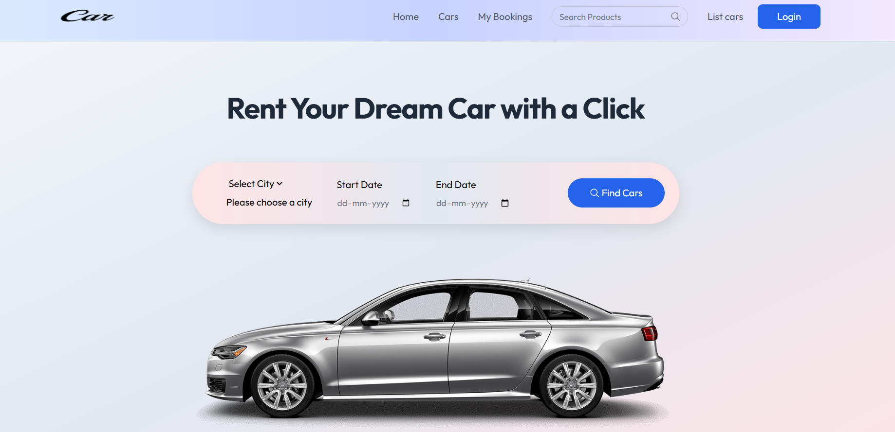
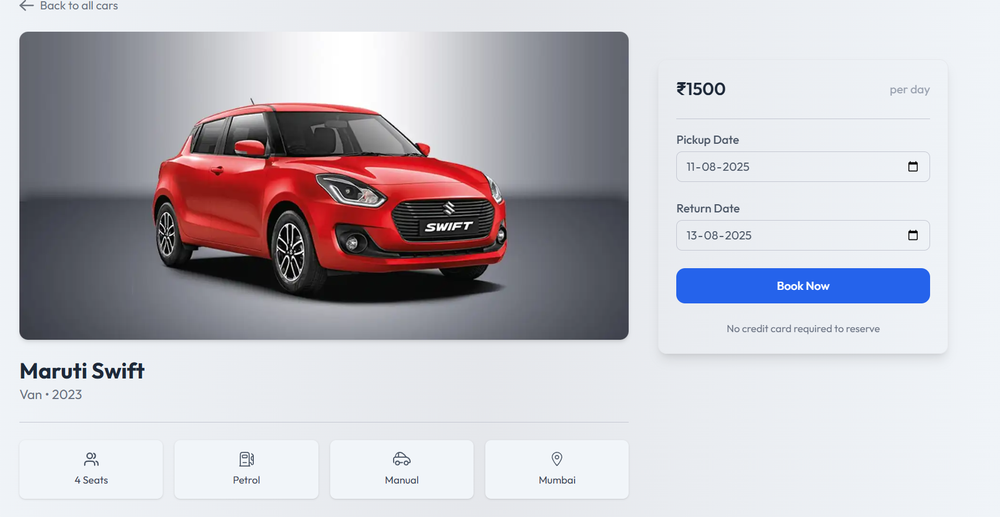
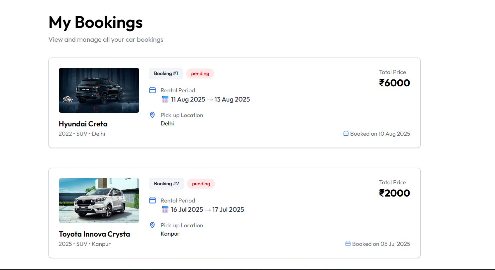

# 🚗 Car Rental Booking System

A complete full-stack **Car Rental Booking Application** where users can browse cars, choose pickup locations & dates, and book cars seamlessly. Admins can manage the car inventory and handle bookings through a dedicated dashboard.

---

## 🚀 Live Demo

🔗 [View Live](https://car-booking-client-brown.vercel.app)

---

## 📸 Screenshots

| 🏠 Homepage | 🚗 Car Details Page | 📅 Booking Page | 
|-------------|--------------------|-----------------|
|  |  |  | 

---

## ✨ Features

### 👥 User Side
- **User Authentication** — Secure sign-up and login using **JWT (JSON Web Tokens)**.
- Browse available cars with search and filters.
- Select pickup location and date.
- View detailed car specifications and availability.
- Book a car with instant confirmation.
- View booking history in user profile.

### 🛠️ Admin Side
- **Admin Dashboard** — Manage all bookings and cars from one place.
- Add new cars with details, pricing, and availability.
- Edit or remove cars from the inventory.
- Approve or reject user bookings.
- Monitor system usage and reports.

---

## ⚙️ Advanced Features

- **JWT Authentication** — Secure and scalable user sessions.
- **ImageKit Integration** — High-quality image optimization and fast delivery.
- **Booking Workflow** — Complete booking system from selection to confirmation.
- **Responsive UI** — Works seamlessly on mobile, tablet, and desktop.

---

## 🧰 Tech Stack

### 💻 Frontend
- React.js
- Tailwind CSS
- Axios
- React Router

### 🖥️ Backend
- Node.js
- Express.js
- MongoDB
- Mongoose
- JWT Authentication
- ImageKit (for media management)

---

## 📂 Folder Structure

```bash
Car_Rental_Booking/
├── frontend/         # React Frontend
│   ├── public/
│   └── src/
├── backend/          # Node.js + Express Backend
│   ├── models/
│   ├── routes/
│   ├── controllers/
│   └── server.js
├── screenshots/      # UI screenshots
└── README.md


```

---

## 🧰 Local Setup Instructions

### ✅ Requirements:
- Node.js installed
- MongoDB connection ( Atlas)

- Vite (comes with frontend)

---

### 1️⃣ Backend Setup

```bash
cd backend
npm install
```

Create a `.env` file in `/backend`:

```env
MONGO_URL=your_mongo_url
JWT_SECRET=your_jwt_secret
IMAGEKIT_PUBLIC_KEY=your_imagekit_public_key
IMAGEKIT_PRIVATE_KEY=your_imagekit_private_key
IMAGEKIT_URL_ENDPOINT=your_imagekit_url_endpoint


```

Start the server:

```bash
npm start
```

---

### 2️⃣ Frontend Setup

```bash
cd ../frontend
npm install
```

Create a `.env` file in `/frontend`:

```env
VITE_BACKEND_URL=http://localhost:5000
VITE_IMAGEKIT_PUBLIC_KEY=your_imagekit_public_key


```

Start the frontend:

```bash
npm run dev
```

> Frontend runs at `http://localhost:5173`

---

## 👨‍💻 Author

**Yash Rana**  
🎓 IET Lucknow  
📧 yashrana097@gmail.com  
🔗 [LinkedIn](https://www.linkedin.com/in/yashrana52)  
💻 [GitHub](https://github.com/YashRana52)
